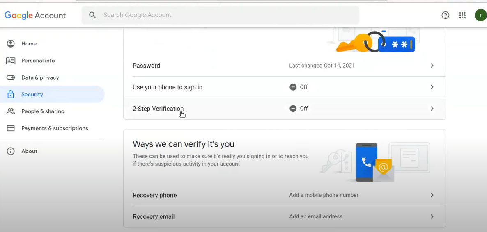
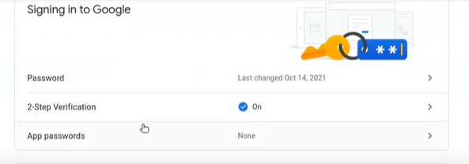
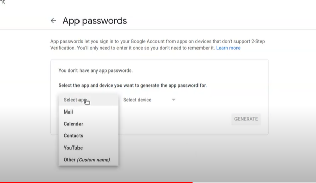
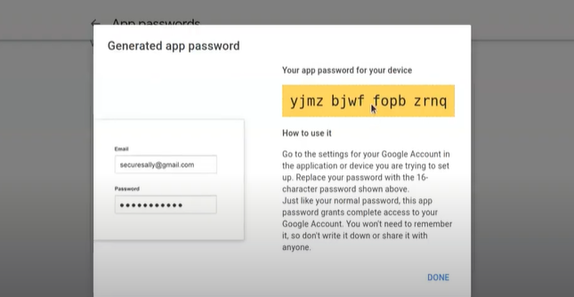
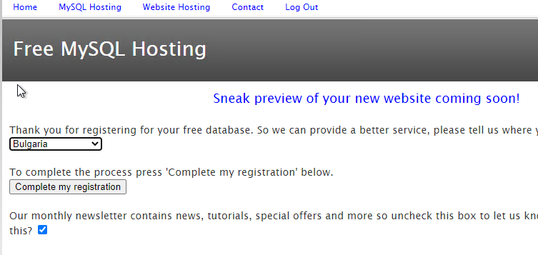
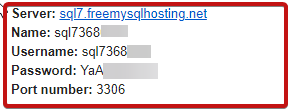
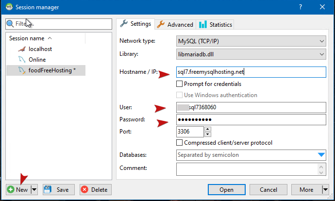

# Step by step deployment guide
### Register new gmail for admin tasks 
- All members of the team can use it
- Avoid exposing personal account password in plain text
- For this document we will refer to gmail account as `AxxFinalProjectExample@gmail.com`. You should choose your own.
- After creating the account we need to do some settings in order to set our gmail account to send verification emails.
- Step one. Set 2 steps verification

- Step two. Login and add a phone number and verify with text messege

- Step three. Under "2-Step Verification" , click on "App passwords"                                  

- Step four. In "Select App" press "Other". Write a description in the open page and press generate.

- Step five. In the open "Generated App Password copy the created password and use it in your smpt password as usual password in 
application properties in Spring.(Check you dont copy spaces).                                                                     

### Use `AxxFinalProjectExample@gmail.com` to register on https://cloudinary.com/
- Used in the app to manage uploaded images and videos
- Here https://cloudinary.com/console you can find your name, API key and API Secret. Copy and paste them in application.properties in Spring.

### Register to https://www.heroku.com/
- Main site where the app will be deployed

### Register to https://www.freemysqlhosting.net/
- Free MySQL database hosting (does not require card for activation)
- **Weekly confirmation** is needed to keep the data base live! - send on the email

- Choose Europe(Mainland) for server location

- Start you database and the connection link, user and password will be send to the email.

- Use `https://www.heidisql.com/` to connect to the remote database

- Open and run database scripts:
    - from `healthy-food-social-network\database`
    - run `create.sql`
    - run `data.sql`
    - you may later promote the first registered user to admin - see comments in data.sql.

### Copy `healthy-food-social-network` folder for example in `D:\ExampleProjects\`

- #### Go to ` D:\ExampleProjects\\healthy-food-social-network\project\src\main\resources`
   - Open `application.properties` with notepad and fill:
      - `healthy.food.host` - your heroku app address (will be generated later)
      - `spring.mail.username` - must be the full gmail address: AxxFinalProjectExample@gmail.com
      - `spring.mail.password` - gmail acount password (do not enter personal account passwords)
      - `cloudinary.cloud_name` 
      - `cloudinary.api_key`
      - `cloudinary.api_secret`
      
      - `database.url` - look at the example urls
      - `database.username`
      - `database.password`

### Follow the heroku guide: https://devcenter.heroku.com/articles/deploying-spring-boot-apps-to-heroku

- #### Install heroku CLI and login
    - needed to work and command heroku via the console/terminal

- #### Skip `Creating a Spring Boot app`
    - We already have spring project

- #### Navigate to `project` folder:
    - cmd example: `cd /d d:\ExampleProjects\healthy-food-social-network\project`

- #### Preparing a Spring Boot app for Heroku
   - `git init`
   - `git add .`
   - `git commit -m "first commit"`
        - We initiate local git repository, then we **add** all files in the `project` folder to be tracked by git and then we commit files current state to git.
    ---
    - `heroku create `
        - Creates remote git repository and heroku application associated with it 
        - Generates unique url for the deployed app
        - Example: `https://tranquil-mountain-19785.herokuapp.com/`
        - Take the url and fill `healthy.food.host` - remove the last `/` or you will get broken confirmation link in the email during registration
        - `git add .` add changes made in application.properties
        - `git commit -m "Add host url in application.properties"` commit changes in the local repository 
    ---
    - `git push heroku master`
        - Push our local changes to the remote heroku git repository and start building and executing the application
    ---
    - `heroku open` 
        - will open the deployed app in the browser

### Register the admin gmail as user in the application
   - promote it in the data base (see above)
   - create some categories - there are images in `...\healthy-food-social-network\images`
   - test & enjoy

#### Redeploy the app if needed (change in the code):
- `git add .`
- `git commit -m "Adding new code"`
---- 
- `git push heroku master`
    - push changes to remote heroku git repository and rebild and restart of the app will follow automatically
---
 - `heroku open` - will open the deployed app in the browser

 

